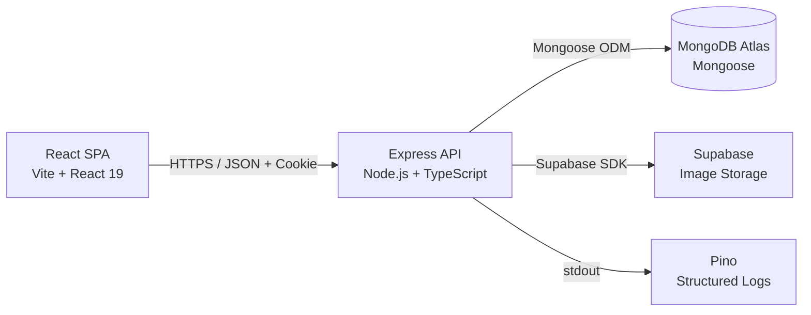
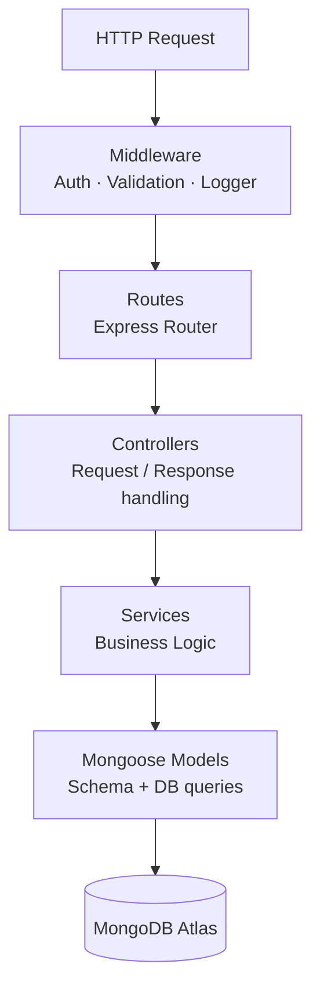
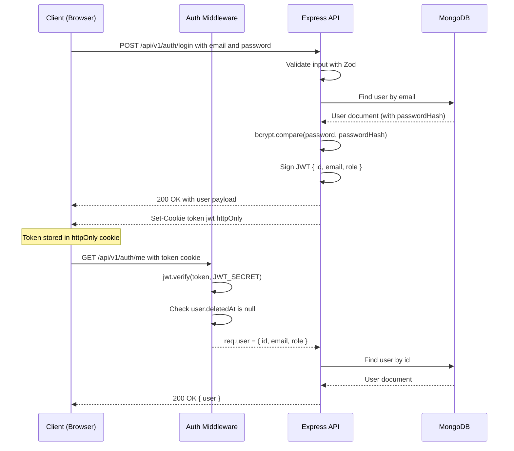
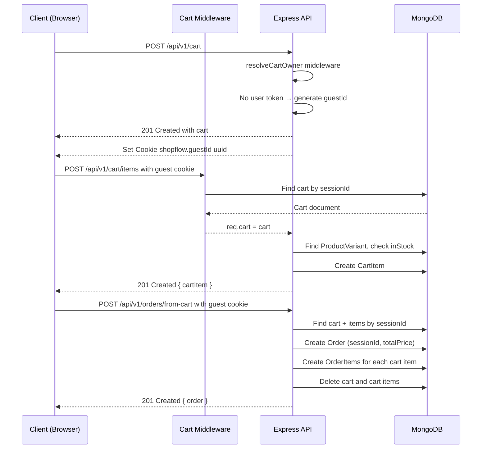
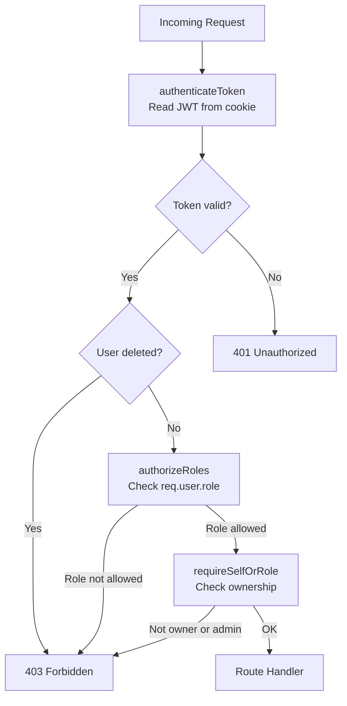
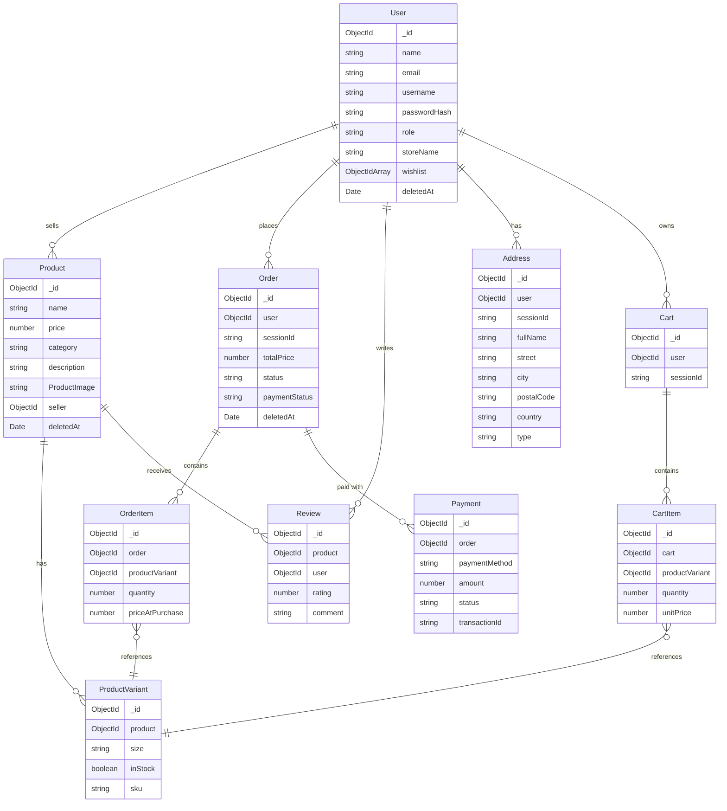

# ShopFlow Architecture

## System Overview

ShopFlow is a monorepo containing a React SPA frontend, a Node.js/Express REST API backend, and a MongoDB Atlas database. Images are stored separately in Supabase.

---

## Backend Layers

The backend follows a layered architecture with clear separation of concerns. Each layer has a single responsibility and communicates only with the layer below it.

**Routes** — Define HTTP method + path, apply middleware, and forward to the controller.  
**Middleware** — Auth (`authenticateToken`, `authorizeRoles`), Zod input validation (`validate`), Pino request logging, and the global error handler.  
**Controllers** — Thin layer: extract request data, call the service, send the response.  
**Services** — All business logic lives here (validation of business rules, DB queries, error throwing).  
**Models** — Mongoose schemas, indexes, and the `pre-save` hooks (e.g. password hashing is done at the service level, not here).

---

## Authentication Flow

### Login and First Authenticated Request

---

## Guest Cart and Checkout Flow

Unauthenticated users can add to cart and complete checkout using a session cookie. The guest session ID is stored in the `shopflow.guestId` cookie.

---

## RBAC Authorization

Role-Based Access Control is enforced through middleware chains on each route.

**Middleware in use:**

| Middleware                  | Purpose                                               |
| --------------------------- | ----------------------------------------------------- |
| `authenticateToken`         | Reads and verifies the JWT cookie, sets `req.user`    |
| `requireAuth`               | Combines token check + soft-delete check              |
| `authorizeRoles(...roles)`  | Rejects if `req.user.role` is not in the allowed list |
| `requireSelfOrRole`         | Allows only the resource owner or a specified role    |
| `requireProductOwnerOrRole` | Allows only the product's seller or an admin          |
| `requireOrderOwnerOrRole`   | Allows only the order's user or an admin              |
| `resolveCartOwner`          | Resolves cart for both logged-in users and guests     |
| `resolveAddressOwner`       | Resolves address for both logged-in users and guests  |

---

## Data Model Relationships

